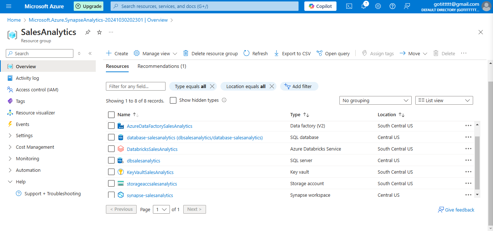
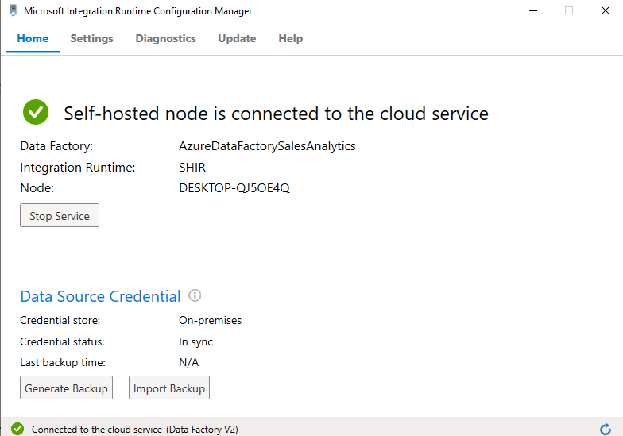
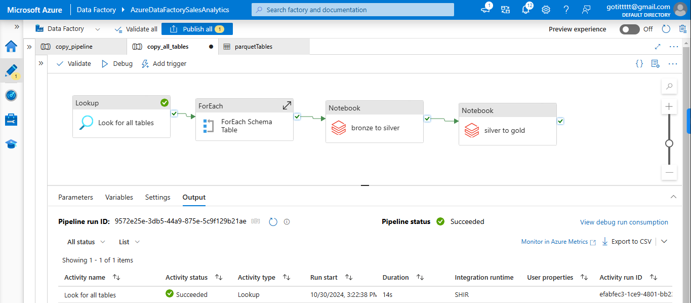
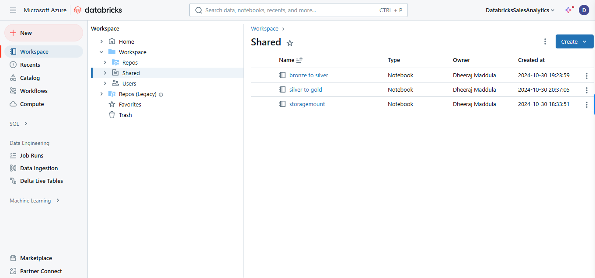
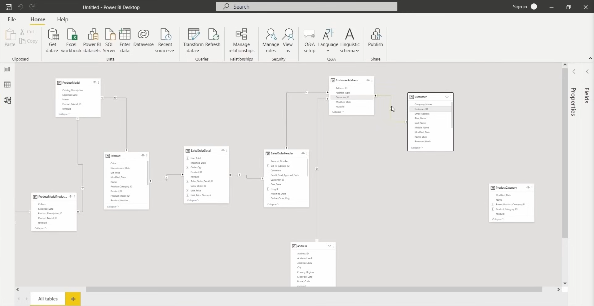
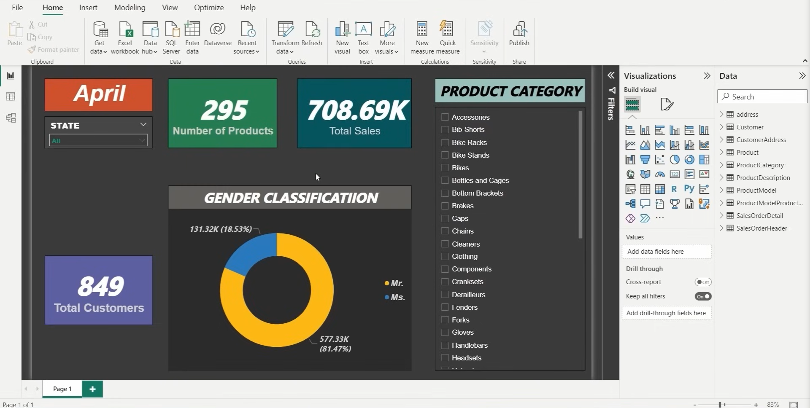

# Sales Analysis | Modern Data Engineering Azure Project
## Objective
The primary objective of this project is to design and implement a comprehensive data pipeline that ingests, processes, and visualizes data from the sales dataset using Azure Cloud services and Power BI. This project aims to demonstrate the ability to extract meaningful insights from a relational dataset to support data-driven decision-making for the business.
In today's data-driven world, organizations need efficient methods to collect, process, and analyze large datasets to gain actionable insights. The real-time dataset contains a retail company's operations, contains valuable information about customers, orders, products, and sales. A Power BI dashboard is built to provide insights into sales trends, customer demographics, and product performance metrics, allowing stakeholders to drill down into specific areas of interest.

## Introduction
This project demonstrates an end-to-end data engineering solution on Microsoft Azure, designed to handle the ingestion, transformation, and analysis of sales data from an on-premises SQL Server database to a comprehensive reporting platform in Power BI. The solution uses Azure Data Lake Storage Gen2, Azure Data Factory, Databricks, Azure Synapse Analytics, and Power BI with added security managed through Azure Key Vault.

## Architecture

## Technology Used
1. Programming Languages - PySpark
2. Scripting Language - SQL
3. Microsoft Azure Cloud
4. Reporting Tool - Power BI
5. Database - Onprem Microsoft SQL Server
6. Self-Hosted Integration Runtime

## Dataset Used
The Sales Analytics dataset is structured using different tables to allow users to perform a variety of operations and queries, providing insights into address, customers, customer address, product, product category, product description, sales order detail, and more. Each table is linked through primary and foreign keys, allowing for comprehensive data analysis.

Here is the dataset used - https://github.com/dheerajmaddula04/sales-analytics/blob/main/Database/SalesAnalyticsLT2022.bak

Original data source - https://learn.microsoft.com/en-us/sql/samples/adventureworks-install-configure?view=sql-server-ver16&tabs=ssms

## Project Overview
### Pipeline Components
1. __Self-Hosted Integration Runtime (SHIR)__:
     - Used for secure data transfer from the on-premises SQL Server to Azure. The SHIR facilitates connectivity between the on-prem environment and Azure Data Factory.
2. __Azure Data Factory (ADF)__:
     - Orchestrates the data pipeline by moving data from the on-premises SQL Server to Azure Data Lake Storage Gen2 via SHIR.
     - Performs data ingestion, using various activities to manage data flow and ensure seamless pipeline execution.
3. __Azure Data Lake Storage Gen2__:
     - Stores ingested data in Bronze, Silver, and Gold layers to manage raw, cleansed, and curated datasets, respectively.
4. __Databricks__:
     - Transforms data from the Silver layer to the Gold layer.
     - Handles complex transformations, cleansing, and data preparation for downstream analytics.
5. __Azure Synapse Analytics__:
     - Acts as the data warehouse, loading curated data from the Gold layer for advanced analytics.
     - Enables efficient query processing and serves as the source for Power BI reporting.
6. __Azure Key Vault__:
     - Manages and secures sensitive information such as database connection strings and API keys used throughout the pipeline.
7. __Microsoft Power BI__:
     - Connects to Azure Synapse Analytics for data visualization and reporting, enabling insights and analysis of the ingested and transformed data.

     __Resource Group:__
     
### Workflow
1. __Data Ingestion__:
     - Data is ingested from an on-premises SQL Server database using SHIR and ADF, moving data securely to Azure Data Lake Storage Gen2.

     __SHIR:__

     

     __Pipeline:__
     

2. __Data Transformation__:
     - Data in the Bronze layer is cleansed and transformed into the Silver layer.
     - Databricks processes the Silver data and produces a refined dataset in the Gold layer.
  
     __Scripts used for project__:
     1. [storagemount.ipynb](<Data Transformations/storagemount.ipynb>)
     2. [bronze to silver.ipynb](<Data Transformations/bronze to silver.ipynb>)
     3. [silver to gold.ipynb](<Data Transformations/silver to gold.ipynb>)

     __Databricks Workspace:__
     

4. __Data Loading and Analysis__:
     - The transformed data from the Gold layer is loaded into Azure Synapse Analytics.
     - Power BI accesses the data from Synapse to create interactive reports and visualizations.
  
     __Data Model:__
     
     
     __Dashboard:__
     

### Security
Azure Key Vault ensures the security of sensitive credentials used in the pipeline, such as database passwords and access keys.

## Conclusion
This project demonstrates how to build a scalable and secure data engineering solution on Azure, using best practices in data storage, transformation, and analytics. It leverages SHIR for secure on-premises connectivity, data layer separation in Azure Data Lake, and integration with powerful analytics and visualization tools like Azure Synapse and Power BI.
