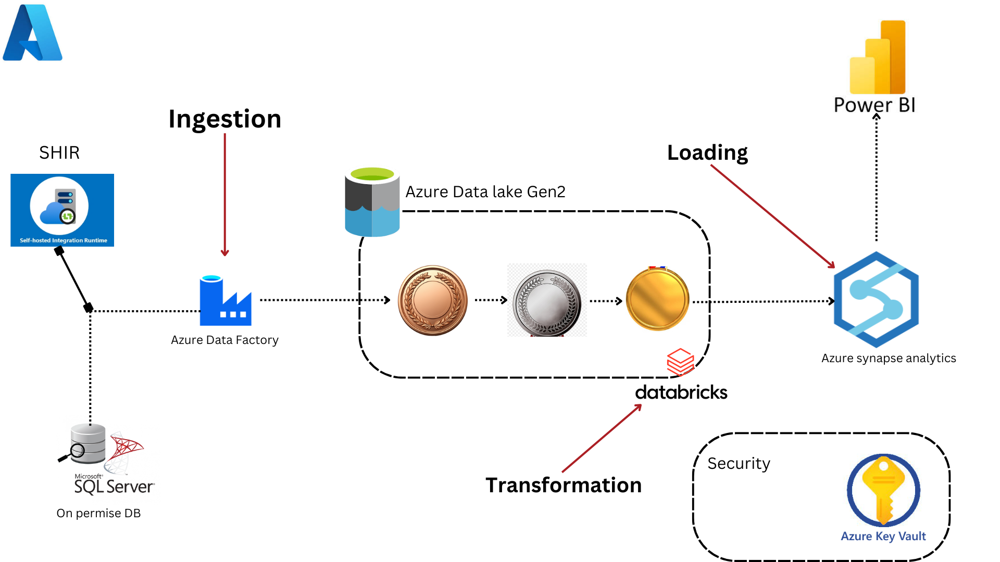

# Sales Analytics | Modern Data Engineering Azure Project
Sales Analytics Data Engineering using Microsoft Azure and Power BI services.

## Introduction
This project demonstrates an end-to-end data engineering solution on Microsoft Azure, designed to handle the ingestion, transformation, and analysis of sales data from an on-premises SQL Server database to a comprehensive reporting platform in Power BI. The solution uses Azure Data Lake Storage Gen2, Azure Data Factory, Databricks, Azure Synapse Analytics, and Power BI with added security managed through Azure Key Vault.

## Architecture

## Technology Used
1. Programming Languages - PySpark
2. Scripting Language - SQL
3. Microsoft Azure Cloud
     - Azure Data Factory
     - Azure Data Lake Storage Gen2
     - Azure Databricks
     - Azure Synapse Analytics
     - Azure Key Vault
4. Reporting Tool - Power BI
5. Database - On-premises Microsoft SQL Server
6. Self-Hosted Integration Runtime

## Dataset Used
The Sales Analytics dataset is structured using different tables to allow users to perform a variety of operations and queries, providing insights into address, customers, customer address, product, product category, product description, sales order detail, and more. Each table is linked through primary and foreign keys, allowing for comprehensive data analysis.

Here is the dataset used - https://github.com/dheerajmaddula04/sales-analytics/blob/main/Database/SalesAnalyticsLT2022.bak

Original data source - https://learn.microsoft.com/en-us/sql/samples/adventureworks-install-configure?view=sql-server-ver16&tabs=ssms

## Challenges

## Conclusion

## Recommendation
